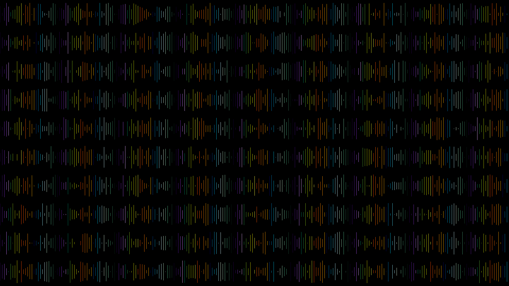

## Overview

Hello and welcome to my personal imaging project!

This Python module generates JPEG images at byte-level granularity. Behind every high-level function to manipulate the contents of an image, underlying byte data is transformed. Once the user is finished manipulating the contents of their image, the underlying bytes are aggregated and represented as a JPEG.

Here are two sample outputs:

Generated via `demo_3.py`:

Generated via `demo_6.py`:

## Installation

1) Clone the repository: `git clone git@github.com:bfeilbach/imaging.git`

2) Run `pipenv install` in this directory to install and resolve dependencies in a virtual environment

## Invocation

I've prepared some demos to showcase my project:

`pipenv run python3 demo_0.py`

...

`pipenv run python3 demo_6.py`

## Author Info

Brian Feilbach

brian.feilbach@gmail.com